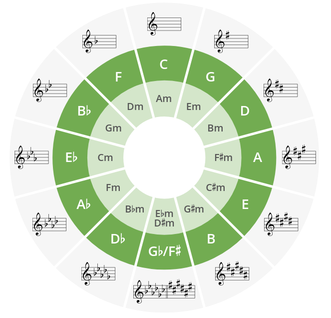

# Major Scale

Let's add circle of Fifths here as well for visibility. 

| Degree   | I     | II    | III   | IV   | V     | VI    | VII  | O     |
| -------- | ----- | ----- | ----- | ---- | ----- | ----- | ---- | ----- |
| Interval |       | W     | W     | H    | W     | W     | W    | H     |
| C        | C     | D     | E     | F    | G     | A     | B    | C     |
| G        | G     | A     | B     | C    | D     | E     | F#   | G     |
| D        | D     | E     | F#    | G    | A     | B     | C#   | D     |
| A        | A     | B     | C#    | D    | E     | F#    | G#   | A     |
| E        | E     | F#    | G#    | A    | B     | C#    | D#   | E     |
| B        | B     | C#    | D#    | E    | F#    | G#    | A#   | B     |
| F# \Gb   | F#\Gb | G#\Ab | A#\Bb | B\Cb | C#\Db | D#\Eb | E#\F | F#\Gb |
| Db       | Db    | Eb    | F     | Gb   | Ab    | Bb    | C    | Db    |
| Ab       | Ab    | Bb    | C     | Db   | Eb    | F     | G    | Ab    |
| Eb       | Eb    | F     | G     | Ab   | Bb    | C     | D    | Eb    |
| Bb       | Bb    | C     | D     | Eb   | F     | G     | A    | Bb    |
| F        | F     | G     | A     | Bb   | C     | D     | E    | F     |
 

